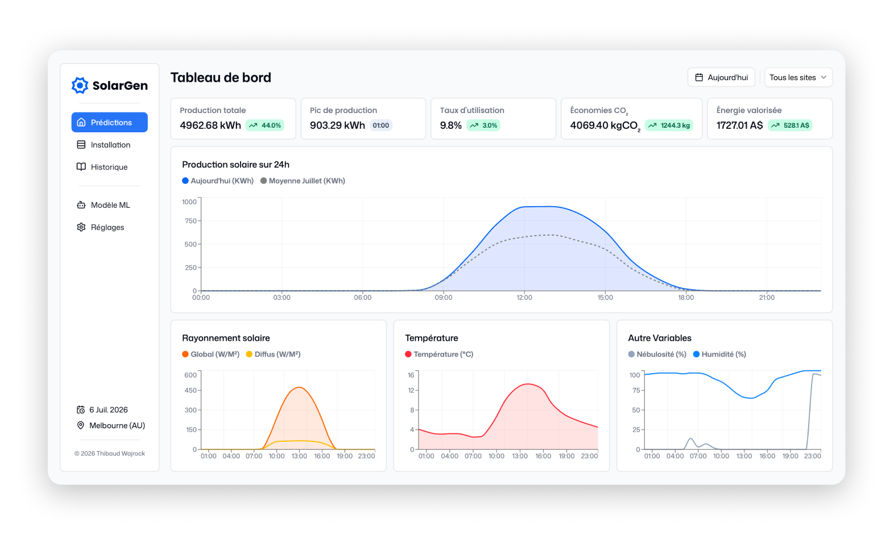
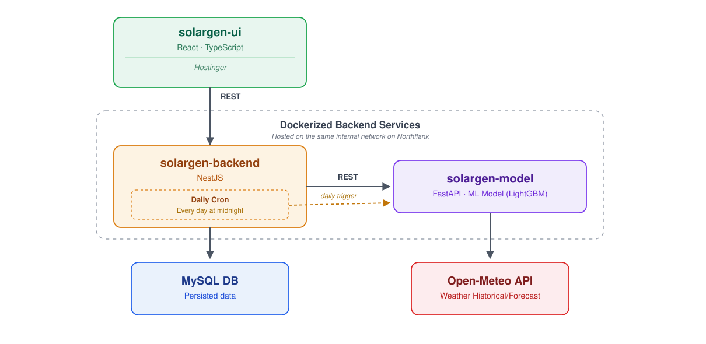

# SolarGen

SolarGen is a full-stack monitoring and forecasting platform based on La Trobe University's Bundoora campus (Melbourne, Australia). It tracks and predicts hourly solar production across 21 rooftop installations, combining a machine learning model with a real-time dashboard so campus managers can monitor output, compare site performance, and review historical trends at a glance.

The forecasts are produced by a LightGBM model trained on the [UNISOLAR dataset](https://www.kaggle.com/datasets/cdaclab/unisolar), fed with live weather data, and served through a dedicated backend to a React dashboard.

**Live demo:** [solargen.wajrock.me](https://solargen.wajrock.me)

**Service documentation:** [`solargen-ui`](./solargen-ui/README.md) · [`solargen-backend`](./solargen-backend/README.md) · [`solargen-model`](./solargen-model/README.md)

## Architecture

The project is split into three independent services, each maintained in its own directory.

| Service                                  | Role                  | Stack                                             | Hosting    |
| ---------------------------------------- | --------------------- | ------------------------------------------------- | ---------- |
| [`solargen-ui`](./solargen-ui)           | Frontend dashboard    | React, TypeScript, Vite, TanStack Query, Recharts | Hostinger  |
| [`solargen-backend`](./solargen-backend) | Business API          | NestJS, Prisma, MySQL                             | Northflank |
| [`solargen-model`](./solargen-model)     | ML prediction service | FastAPI, LightGBM                                 | Northflank |

A daily cron job fetches new predictions from `solargen-model` and populates the MySQL database, which the backend then serves to the frontend.

## Context

The Bundoora campus operates 21 solar installations with a combined capacity of approximately 1,842 kWp. Hourly production forecasts are generated daily by a LightGBM model trained on the UNISOLAR dataset, using weather variables (temperature, solar radiation, cloud cover) retrieved from the Open-Meteo API.

## Features

- **Overview**: daily predictions, capacity factor, CO₂ savings, and estimated energy value, benchmarked against the monthly average
- **Installation**: comparative view of all 21 sites, filterable by performance level and inverter model
- **History**: month-over-month production comparison between the current and previous year
- **ML Model**: model performance metrics (R², MAE), input features, and the status of the latest prediction run

## Testing

Each service maintains its own test suite. See the respective README for setup and execution instructions.

| Service            | Framework | Scope                          |
| ------------------ | --------- | ------------------------------ |
| `solargen-ui`      | Vitest    | Hooks, utilities, components   |
| `solargen-backend` | Jest      | Services, controllers, e2e     |
| `solargen-model`   | pytest    | Prediction logic, data parsing |

## Deployment

- **Frontend**: deployed to Hostinger via GitHub Actions on every push
- **Backend & Model**: deployed to Northflank with path-based build triggers, so each service only rebuilds when its own directory is modified

## License

This project is licensed under the [MIT License](./LICENSE).

## Author

**Thibaud Wajrock**
[wajrock.me](https://wajrock.me)
