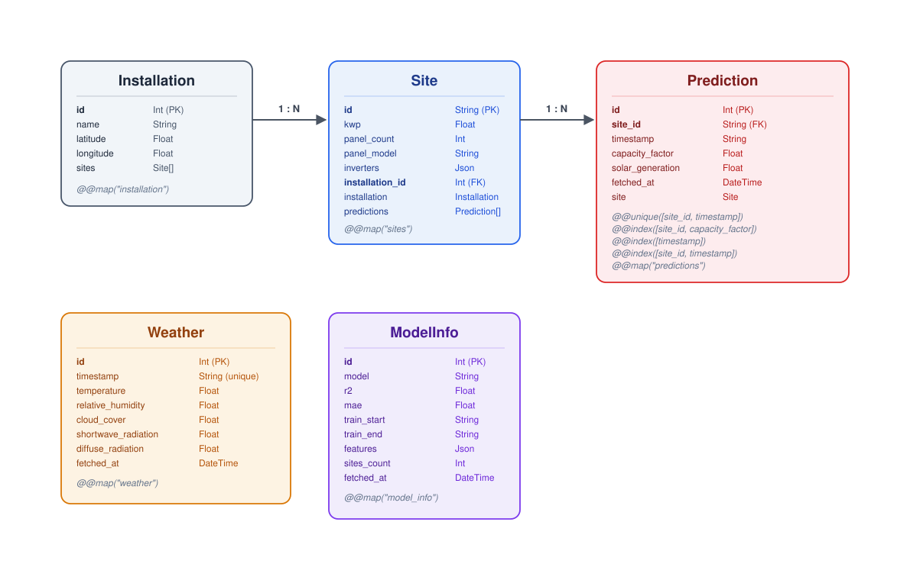

# SolarGen Backend

> Part of the [SolarGen](../README.md) project — see the root README for the full architecture overview.

**Live API & docs:** [Swagger documentation](https://api--solargen-backend--mdh6jkptypjr.code.run/docs)

REST API powering the SolarGen dashboard. It serves solar production predictions, installation metadata, historical comparisons, and ML model information to [`solargen-ui`](../solargen-ui), backed by a MySQL database.

## Tech Stack

- **NestJS** — application framework
- **Prisma** — ORM and database schema management
- **MySQL** — data persistence
- **Swagger** — API documentation
- **Jest** — unit and end-to-end testing
- **Axios** — HTTP client used to fetch predictions from `solargen-model`

## Endpoints Overview

| Method | Endpoint                     | Description                                                    |
| ------ | ---------------------------- | -------------------------------------------------------------- |
| `GET`  | `/predictions/status`        | Status of the most recently fetched predictions                |
| `GET`  | `/predictions/today`         | Today's hourly predictions, campus-wide                        |
| `GET`  | `/predictions/today/:siteId` | Today's hourly predictions for a specific site                 |
| `GET`  | `/predictions/:date`         | Hourly predictions for a past date, campus-wide                |
| `GET`  | `/predictions/:date/:siteId` | Hourly predictions for a past date and site                    |
| `GET`  | `/installation`              | Metadata and performance for all 21 sites                      |
| `GET`  | `/history/:month`            | Current vs. previous year comparison for a given month         |
| `GET`  | `/history/:month/:siteId`    | Same comparison, scoped to a specific site                     |
| `GET`  | `/model-info`                | Model metrics (R², MAE) and training details                   |
| `POST` | `/predictions/:date`         | Triggers prediction ingestion for a date. Requires an API key. |

**Example response** — `GET /predictions/today` (truncated, showing one of 24 hourly entries)

```json
{
    "date": "2026-07-07",
    "daily": {
        "solar_generation": 4856.2,
        "capacity_factor": 0.096
    },
    "monthly_avg": {
        "solar_generation": 3646.85,
        "capacity_factor": 0.072
    },
    "peak": {
        "timestamp": "2026-07-07T12:00:00",
        "solar_generation": 893.35
    },
    "hourly": [
        {
            "timestamp": "2026-07-07T12:00:00",
            "production": {
                "solar_generation": 893.35,
                "capacity_factor": 0.423,
                "monthly_avg": {
                    "solar_generation": 622.54,
                    "capacity_factor": 0.295
                }
            },
            "weather": {
                "timestamp": "2026-07-07T12:00:00",
                "temperature": 10.3,
                "relative_humidity": 77,
                "cloud_cover": 1,
                "shortwave_radiation": 437,
                "diffuse_radiation": 90
            }
        }
    ]
}
```

## Database Schema



## Key Architecture Components

```
src/
├── endpoints/
│   ├── predictions/   # Daily and historical prediction endpoints, cron ingestion
│   ├── installation/  # Site metadata and performance aggregation
│   ├── history/       # Month-by-month year-over-year comparison logic
│   └── model-info/    # ML model metrics endpoint
├── guards/            # API key guard
└── prisma/            # Prisma service and client
```

## Data Ingestion

A scheduled cron job runs daily at 1:00 AM (Australia/Melbourne), fetching the day's predictions from `solargen-model` and persisting them to MySQL via Prisma. This keeps the whole architecture self-sufficient — the dashboard always has fresh data without any manual intervention. The same ingestion logic is also exposed through the protected `POST /predictions/:date` endpoint for on-demand backfills.

## Testing

The test suite does not require any environment configuration — external dependencies (database, `solargen-model`) are fully mocked. Requires Node.js 20+.

```bash
npm install
npm run test        # unit tests
npm run test:cov    # unit tests with coverage report
npm run test:e2e    # end-to-end tests
```

Unit tests cover all services and controllers, with dedicated end-to-end tests exercising the full request pipeline, including guards and validation. DTOs and boilerplate files are excluded from coverage reporting.

## CI/CD & Deployment

The service is deployed to [Northflank](https://northflank.com/) through a Docker-based CI/CD pipeline:

| Stage          | Description                                                                                                                                                                             |
| -------------- | --------------------------------------------------------------------------------------------------------------------------------------------------------------------------------------- |
| Trigger        | A push touching `solargen-backend/` triggers a build. Path-based rules keep each service's pipeline independent.                                                                        |
| Build & verify | In the `builder` stage, dependencies are installed, the Prisma client is generated, and the code is linted, unit-tested, and end-to-end tested. A failure at any step blocks the build. |
| Compile        | Once verified, the TypeScript source is compiled.                                                                                                                                       |
| Package        | A separate, minimal `runner` stage installs only production dependencies and copies the compiled output — keeping the final image lean and free of dev tools.                           |
| Deploy         | The resulting image is deployed automatically to Northflank.                                                                                                                            |
